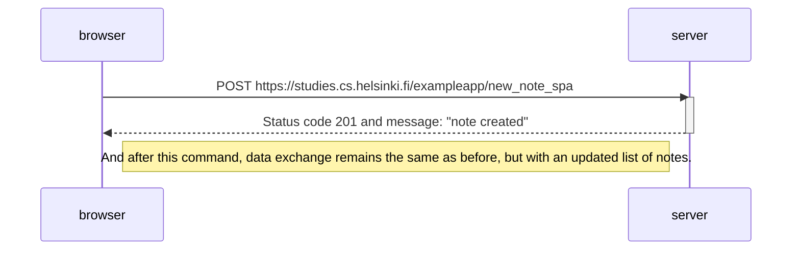

```mermaid
sequenceDiagram
    participant browser
    participant server
    
    browser->>server: POST https://studies.cs.helsinki.fi/exampleapp/new_note_spa
    activate server
    server-->>browser: Status code 201 and message: "note created"
    deactivate server
    
    Note right of browser: And after this command, data exchange remains the same as before, but with an updated list of notes.
```
